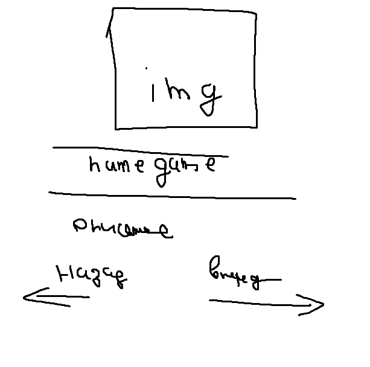
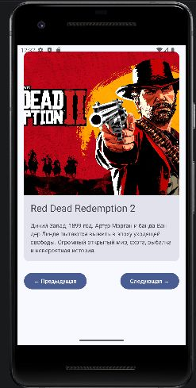

# Game Wiki — каталог игр

## Цель работы
Создать интерактивное приложение на Jetpack Compose

## Использованные элементы
- Column, Row, Card, Image, Text, Button, Spacer
- Modifier для отступов и размеров
- remember и mutableStateOf для состояния

## Логика
- 5 игр: Red Dead Redemption 2, The Witcher 3, Terraria, Subnautica, Minecraft
- Кнопки переключают игры по кругу

## Скриншоты
## Low-fi прототип

## Экран приложения

## Автор
[Богданов Иван] | Группа [ИСП-233]